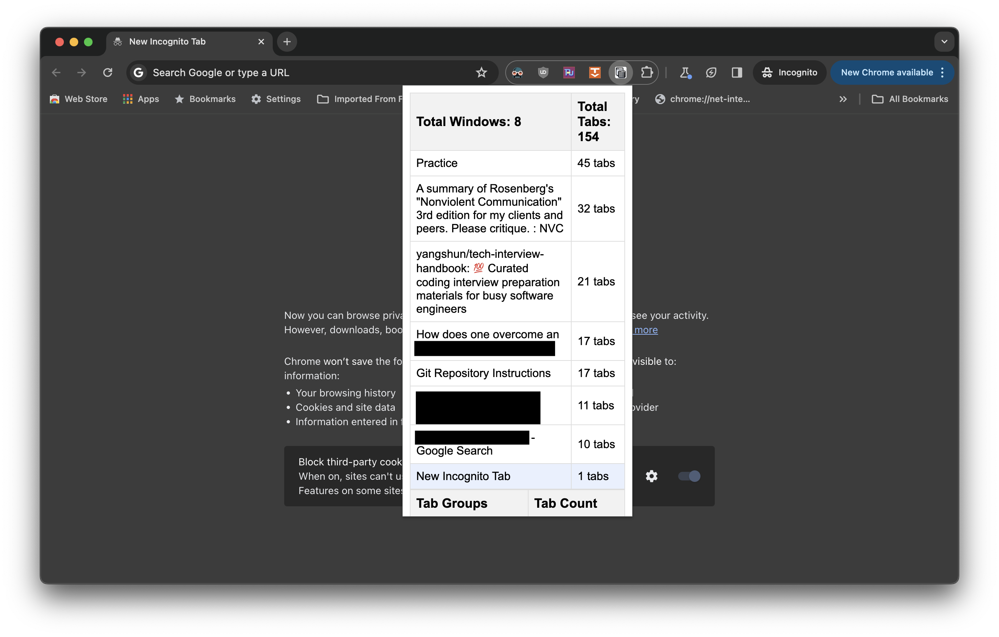
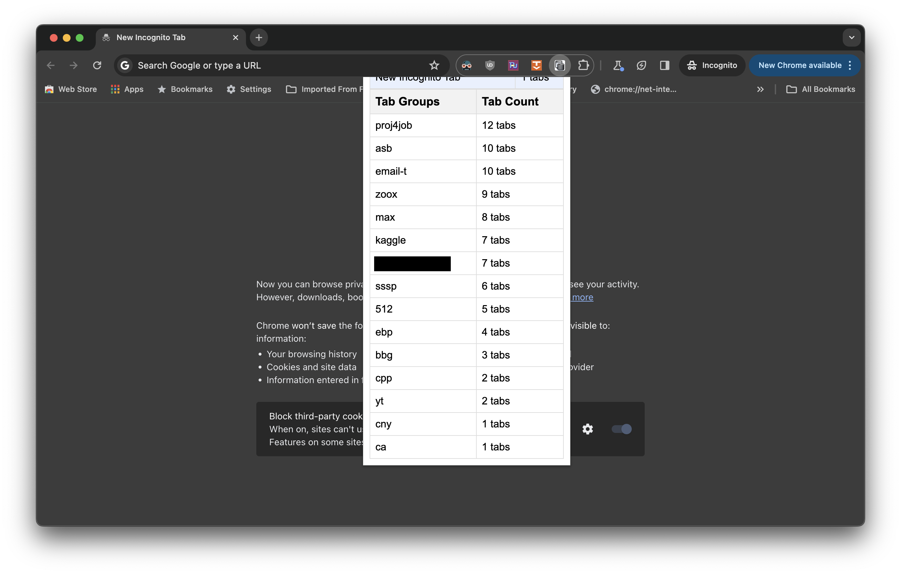

# Window & Tab Stats Chrome Extension

Window & Tab Stats is a handy Chrome extension that helps you manage your browsing more efficiently by keeping track of the number of open windows and tabs, as well as organizing them into tab groups for better accessibility.

## Features

- Displays the total number of open windows and tabs in your browser.
- Lists all open windows with the number of tabs in each, highlighting the current window.
- Organizes and displays tab groups along with their tab counts.
- Simple, user-friendly interface.

## Installation

To install the Window & Tab Stats extension, visit the Chrome Web Store:

(Coming soon!)

<!-- [Window & Tab Stats Extension](https://chrome.google.com/webstore/detail/prepend-url/nkohlbebkognioabnnjchnchdapolofb) -->

## Usage

After installing the extension, click on the Window & Tab Stats icon in your Chrome toolbar to view the popup with all the information about your open windows and tab groups.

## Screenshots

Here are a couple of screenshots showing what the Window & Tab Stats extension looks like in action:

## Icon

Here is the icon for the Window & Tab Stats Chrome Extension:

## Support

If you encounter any issues or have any suggestions for improvements, please feel free to reach out by [filing an issue on GitHub](https://github.com/tddschn/browser-window-and-tab-stats-extension/issues).

Thank you for using Window & Tab Stats!

